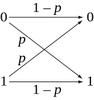
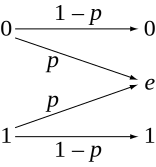

# Discrete Channel

[TOC]

## Define

Discrete Channel refers to a communication channel where both the input and output signals take values from a finite or countable set.

## Property

### Channel Capacity

$$
\begin{align*}
\left\{\begin{matrix}
  I(x_i ; Y) &= \sum\limits_j p_{ij} \log \frac{p_{ij}}{q_j} = C  \quad \text{when } p_i > 0  \\ \\
  I(x_i ; Y) &= \sum\limits_j p_{ij} \log \frac{p_{ij}}{q_j} \le C  \quad \text{when } p_i = 0
\end{matrix}\right.
\end{align*}
$$

### Discrete Symmetric Channel

弱对称信道
$$
C = H(Y) - H(p_{1i},...)
$$

强对称信道, 因为强对称信道的输出也是等概率的, 所以$H(Y) = \log N_y$.
$$
C = \log N_y - H(p_{1i},...)
$$

信道矩阵可逆的信道
$$
\begin{align*}
  C &= \log\left( \sum_i 2^{β_i} \right) = \left\{\begin{matrix}
    \mathbb P_{Yi} = \frac{2^{β_i}}{\sum_j 2^{β_j}}  \\
    \mathbb P_X^T = \mathbb P_Y^T P^{-1}
  \end{matrix}\right.  \\
  β &= -P^{-1} h  \\
  h &= \left(\begin{matrix} H(P_{1j}) \\ \vdots \\ H(P_{nj}) \end{matrix}\right)
\end{align*}
$$

### Binary Symmetric Channel

$$
\begin{align*}
\mathbb P(Y=1 | X=0) &= p \\
\mathbb P(Y=0 | X=1) &= p \\ 
\mathbb P(Y=0 | X=0) &= 1 - p \\
\mathbb P(Y=1 | X=1) &= 1 - p
\end{align*}  \tag{transition probability}
$$

A Binary Symmetric Channel (BSC) has two input symbols (0 and 1) and a probability $p$ of flipping the bit. The capacity as shown below, as noise increases ($p \to 0.5$), capacity decreases, and when $p = 0.5$, the channel carries no useful information ($C = 0$).

$$
\begin{align*}
C &= 1 - H(p)\\
H(p) &= - p \log_2 p - (1 - p) \log_2 (1 - p)
\end{align*}
$$

- $H(p)$: binary entropy function

### Binary Erasure Channel

$$
C = 1 - \epsilon
$$

A Binary Erasure Channel (BEC) has two inputs (0,1) and an erasure probability $\epsilon$, meaning the symbol is lost with probability $\epsilon$. The channel can transmit $(1 - \epsilon)$ fraction of bits reliably.

### Discrete Memoryless Channel

$$
C = \max_{p(x)} \sum_{x \in X} \sum_{y \in Y} p(x) P(y|x) \log_2 \frac{P(y|x)}{P(y)}
$$

For a general discrete memoryless channel (DMC) with input alphabet $X$ and output alphabet $Y$,
- $P(y|x)$ is the channel transition probability.
- $P(y)$ is the output probability.

## Appendix

### Proof of Channel Capacity

问题表示为$p_{ij}$确定且已知, 求$I(X;Y)$的最大值及其$p_i$的优化问题,
$$
\begin{align*}
\max \quad& I(X;Y) = \sum_{i,j} p_{ij} p_i \log p_{ij} - \sum_j q_j \log q_j  \\
s.t. \quad& p_i ≥ 0  \\
  & \sum_i p_i = 1
\end{align*}
$$

Lagrange function,
$$
L(p_i, λ, ν) = -\sum_{i,j} p_{ij} p_i \log p_{ij} + \sum_j q_j \log q_j + \sum_i λ_i (- p_i) + ν \left(\sum_i p_i - 1\right) \tag{Lagrange function}
$$

$$
\begin{align*}
\Rightarrow \frac{∂ L}{∂ p_i} |_{p_i = p_i^*}  
&= -\sum_j p_{ij} (\log p_{ij} - \log q_j - \log e) - λ_i^* + ν^* \tag{Derivation,$\frac{∂ q_j}{∂ p_i} = \frac{∂ \sum_i p_i p_{ij}}{∂ p_i} = p_{ij}$}  \\
&= -\sum_j p_{ij} \log \frac{p_{ij}}{q_j} + \log e - λ_i^* + ν^* \tag{$\sum_j p_{ij} = 1$}  \\
&= 0
\end{align*}
$$

KKT conditions,
$$
\begin{align*}
p_i^* &≥ 0  \\
\sum_i p_i^* &= 1  \\
λ_i &≥ 0  \\
λ_i p_i^* &= 0  \\
\sum_j p_{ij} \log \frac{p_{ij}}{q_j^*} &= \log e - λ_i^* + ν^*
\end{align*}
$$

第5式得$λ_i = -\sum_j p_{ij} \log \frac{p_{ij}}{q_j^*} + \log e + ν^*$, 回代消去$λ$, 
$$
\begin{align*}
p_i^* &≥ 0  \\
\sum_i p_i^* &= 1  \\
\sum_j p_{ij} \log \frac{p_{ij}}{q_j^*} &≥ \log e + ν^*  \\
\left(-\sum_j p_{ij} \log \frac{p_{ij}}{q_j^*} + \log e + ν^*\right) p_i &= 0
\end{align*}
$$

